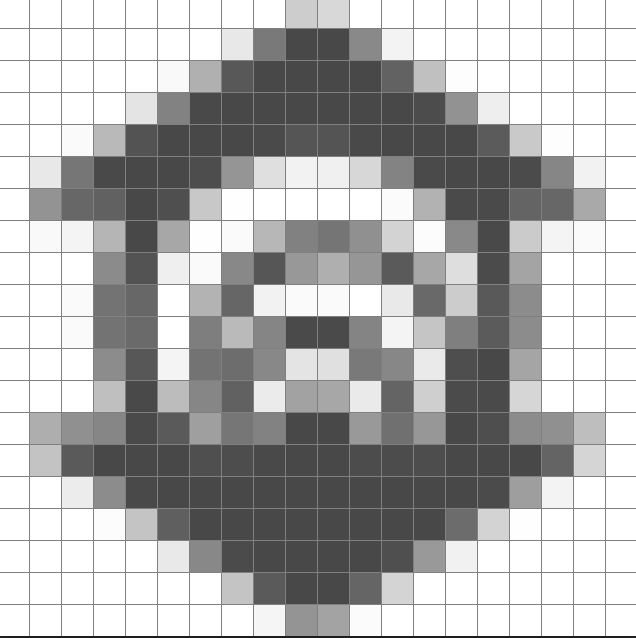
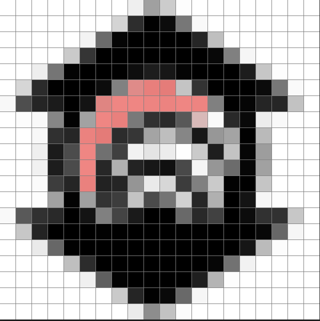
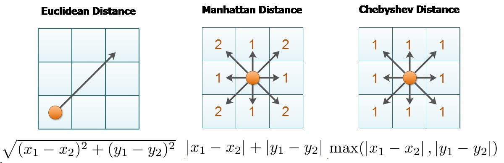

# **Implementando da Ferramenta Balde de Tinta**

## **Contexto**

Considere o desenvolvimento de um software de edição de imagens que necessita da implementação de uma funcionalidade denominada **Balde de Tinta**. Essa funcionalidade executa a substituição da cor de uma região conexa na imagem, partindo de um ponto inicial definido pelo usuário.

A imagem é representada por uma **matriz** onde cada célula contém um número correspondente a uma cor. Quando o usuário seleciona um ponto da imagem e escolhe uma nova cor, a ferramenta deve **preencher toda a região conectada** que tenha a mesma cor inicial.


**Figura 1**: Aplicação da ferramenta proprosta para vizinhança 4-conectada ([distância de Manhattan](https://materialpublic.imd.ufrn.br/curso/disciplina/5/2/1/11)). À esquerda, a matriz original com um ponto inicial destacado. À direita, a matriz modificada após a aplicação do preenchimento. Fonte. [LeetCode](https://leetcode.com/problems/flood-fill/description/).

## **Objetivo**

Implementar a funcionalidade **Balde de Tinta**, garantindo que áreas conectadas sejam preenchidas corretamente.

## **Regras da Simulação**

Os dados de entrada são uma imagem representada por uma matriz $m \times n$ de números inteiros, onde $\text{image}[i][j]$ representa o valor do pixel da imagem, três números inteiros: $sr$, $sc$ e $color$. Sua tarefa é executar um preenchimento de uma área específica na imagem de mesma cor, começando a partir do pixel $\text{image}[sr][sc]$.

### Dados de entrada

* Instäncia pequena do problema para testes (matriz 20x20): `data/UNIFOR_sample.txt`, `5`, `7`, `2`.
* Instäncia do problema (matriz 1000x1000): `data/UNIFOR_grayscale.txt`, `318`, `911`, `0`.

## **Exemplo 1**

### **Entrada:**

Imagem original (matriz 5x5):

```plaintext
1 1 1 2 2
1 1 1 2 2
1 3 3 2 2
1 3 3 2 2
1 1 1 1 1
```

Ponto escolhido: `(0,0)`\
Nova cor: `9`

### **Saída esperada:**

```plaintext
9 9 9 2 2
9 9 9 2 2
9 3 3 2 2
9 3 3 2 2
9 9 9 9 9
```

## **Exemplo 2**

### **Entrada:**

Imagem original:



Matriz original (matriz 20x20):

```plaintext
1 1 1 1 1 1 1 1 1 1 1 1 1 1 1 1 1 1 1 1
1 1 1 1 1 1 1 1 0 0 0 0 1 1 1 1 1 1 1 1
1 1 1 1 1 1 0 0 0 0 0 0 0 1 1 1 1 1 1 1
1 1 1 1 1 0 0 0 0 0 0 0 0 0 1 1 1 1 1 1
1 1 1 0 0 0 0 0 0 0 0 0 0 0 0 0 1 1 1 1
1 1 0 0 0 0 0 1 1 1 1 1 0 0 0 0 0 0 1 1
1 0 0 0 0 0 1 1 1 1 1 1 1 1 0 0 0 0 1 1
1 1 1 1 0 1 1 1 0 0 0 0 1 1 0 0 1 1 1 1
1 1 1 0 0 1 1 0 0 1 1 1 0 1 1 0 1 1 1 1
1 1 1 0 0 1 0 0 1 1 1 1 1 0 1 0 1 1 1 1
1 1 1 0 0 1 0 1 0 0 0 0 1 1 0 0 1 1 1 1
1 1 1 0 0 1 0 0 1 1 1 0 1 1 0 0 1 1 1 1
1 1 1 1 0 1 0 0 1 0 0 1 0 1 0 0 1 1 1 1
1 0 0 0 0 0 1 0 0 0 0 0 0 0 0 0 0 0 1 1
1 1 0 0 0 0 0 0 0 0 0 0 0 0 0 0 0 0 1 1
1 1 1 0 0 0 0 0 0 0 0 0 0 0 0 0 1 1 1 1
1 1 1 1 1 0 0 0 0 0 0 0 0 0 0 1 1 1 1 1
1 1 1 1 1 1 0 0 0 0 0 0 0 1 1 1 1 1 1 1
1 1 1 1 1 1 1 1 0 0 0 0 1 1 1 1 1 1 1 1
1 1 1 1 1 1 1 1 1 1 1 1 1 1 1 1 1 1 1 1
```

Ponto escolhido: `(5,7)`\
Nova cor: `2`

### **Saída esperada:**

Matriz final (viznhança 4-conectada):

```plaintext
1 1 1 1 1 1 1 1 1 1 1 1 1 1 1 1 1 1 1 1
1 1 1 1 1 1 1 1 0 0 0 0 1 1 1 1 1 1 1 1
1 1 1 1 1 1 0 0 0 0 0 0 0 1 1 1 1 1 1 1
1 1 1 1 1 0 0 0 0 0 0 0 0 0 1 1 1 1 1 1
1 1 1 0 0 0 0 0 0 0 0 0 0 0 0 0 1 1 1 1
1 1 0 0 0 0 0 2 2 2 2 2 0 0 0 0 0 0 1 1
1 0 0 0 0 0 2 2 2 2 2 2 2 2 0 0 0 0 1 1
1 1 1 1 0 2 2 2 0 0 0 0 2 2 0 0 1 1 1 1
1 1 1 0 0 2 2 0 0 1 1 1 0 2 2 0 1 1 1 1
1 1 1 0 0 2 0 0 1 1 1 1 1 0 2 0 1 1 1 1
1 1 1 0 0 2 0 1 0 0 0 0 1 1 0 0 1 1 1 1
1 1 1 0 0 2 0 0 1 1 1 0 1 1 0 0 1 1 1 1
1 1 1 1 0 2 0 0 1 0 0 1 0 1 0 0 1 1 1 1
1 0 0 0 0 0 1 0 0 0 0 0 0 0 0 0 0 0 1 1
1 1 0 0 0 0 0 0 0 0 0 0 0 0 0 0 0 0 1 1
1 1 1 0 0 0 0 0 0 0 0 0 0 0 0 0 1 1 1 1
1 1 1 1 1 0 0 0 0 0 0 0 0 0 0 1 1 1 1 1
1 1 1 1 1 1 0 0 0 0 0 0 0 1 1 1 1 1 1 1
1 1 1 1 1 1 1 1 0 0 0 0 1 1 1 1 1 1 1 1
1 1 1 1 1 1 1 1 1 1 1 1 1 1 1 1 1 1 1 1
```

Imagem representativa do resultado final:



## **Estratégias de Implementação**

### **BFS (Busca em Largura)**

- **Vantagens:** Utiliza uma fila para explorar os vizinhos de forma iterativa, garantindo uma expansão ordenada da área preenchida.
- Reduz a profundidade de chamadas recursivas, sendo uma alternativa eficiente para evitar o estouro da pilha em matrizes de grande dimensão.
- **Desvantagens:** Apresenta um maior consumo de memória em matrizes extensas, devido ao armazenamento explícito de todas as células a serem processadas na estrutura de fila.

### **DFS (Busca em Profundidade)**

- **Vantagens:** Utiliza recursão ou uma pilha explícita para explorar um caminho até o fim antes de retroceder, permitindo uma implementação mais simples.
- Funciona bem para áreas pequenas, pois pode ser mais rápido e requer menos estrutura adicional.
- **Desvantagens:** A abordagem recursiva pode levar a estouro de pilha em matrizes de grande dimensão, tornando-se menos viável para o processamento de imagens extensas.

## Avaliação

Este trabalho visa avaliar a implementação de algoritmos de preenchimento de área em imagens digitais, considerando diferentes estratégias de conectividade. 

A modelagem do problema deve ser feita utilizando uma **estrutura em grafos**, onde cada célula da matriz representa um vértice e suas conexões com células vizinhas representam arestas do grafo. Apenas soluções que utilizem essa estrutura serão consideradas para avaliação. Implementações que **não empreguem uma abordagem baseada em grafos serão desqualificadas e atribuídas nota zero**.

A pontuação será atribuída da seguinte forma:

* Implementações que utilizarem apenas a **vizinhança 4-conectada, ou seja, vizinhos horizontais e verticais,**, baseada na [distância de Manhattan](https://materialpublic.imd.ufrn.br/curso/disciplina/5/2/1/11), receberão **2 pontos**.

* Implementações que incluírem a **vizinhança 8-conectada, ou seja, vizinhos horizontais, verticais e nas diagonais superior e inferior**, baseada na [distância de Chebyshev](), ampliando a conectividade do preenchimento, receberão **3 pontos**.



**Figura 2**: A Figura 2 apresenta a comparação entre três métricas de distância: Euclidiana, Manhattan e Chebyshev. A distância Euclidiana mede a linha reta entre dois pontos, a Manhattan considera apenas deslocamentos horizontais e verticais, enquanto a Chebyshev permite movimentos horizontais, verticais e diagonais. Fonte: [OpenGenus](https://iq.opengenus.org/euclidean-vs-manhattan-vs-chebyshev-distance/).